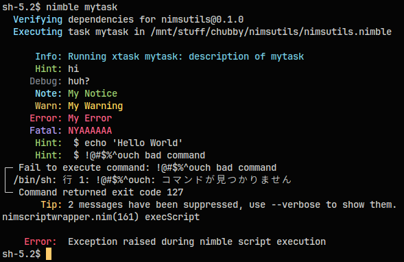

# nimsutils

A bunch of utility functions for [NimScript].

## Why

Feel like NimScript is so cool but lacking a lot of stuff and breaks too easily?
This is pretty much what you want. `nimsutils` include support for:

- pretty logging
  - Last time I searched (2024-05-13) there are quite literally no good nimble packages for even
    nim itself. No good pretty loggers in even Nim! Ridiculous!
  - [Logit] exists but it's hard to customize, it's probably the closest thing.
- running shell commands (`run()`)
- setting up tasks in nimble (`xtask`)
- time support
  - yes you actually can't import `std/[times, monotimes]` in NimScript
  - you can do stuff like benchmarking with `time "Benchmark name":`
- makefile-ish syntax supported using the `@=` operator

## Example

There's literally an example in the `nimsutils.nimble` file:
```nim
xtask mytask, "description of mytask":
  hint "hi"
  trace "https://youtu.be/Tl62BvTYUVA"
  debug "huh?"
  note "My Notice"
  warn "My Warning"
  error "My Error"
  fatal "NYAAAAAA"
  run "echo 'Hello World'"
  run "!@#$%^ouch bad command"
```
\
(Note: `sh` outputted Japanese due to my locale settings.)

There are more examples in `test.nims`.

## Getting Started

Yes, you heard me: start using `nimsutils` by just:
1. cloning this repository:
```sh
git clone https://github.com/FyraLabs/nimsutils --depth 1
```
2. ```nim
   import nimsutils
   ```
3. (optional) Replace `task` with `xtask`

## Use Cases

Todo

## Documentations

Todo


[NimScript]: https://nim-lang.org/docs/nims.html
[Logit]: https://github.com/Miqueas/Logit/blob/main/NimDocs.md
